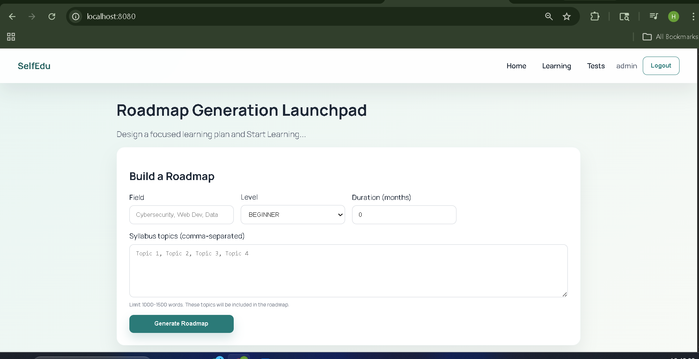
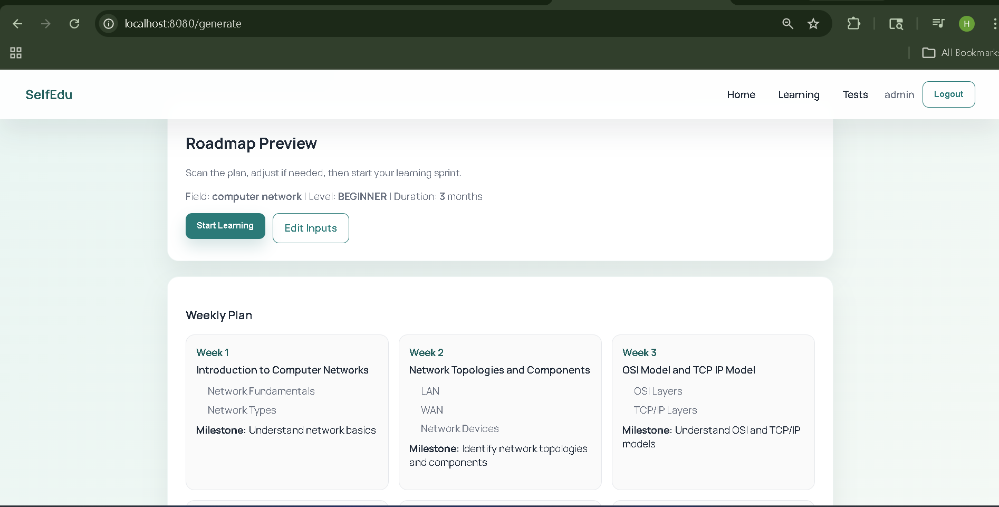
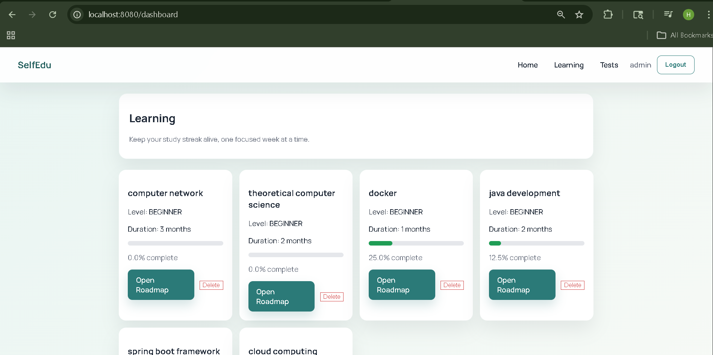
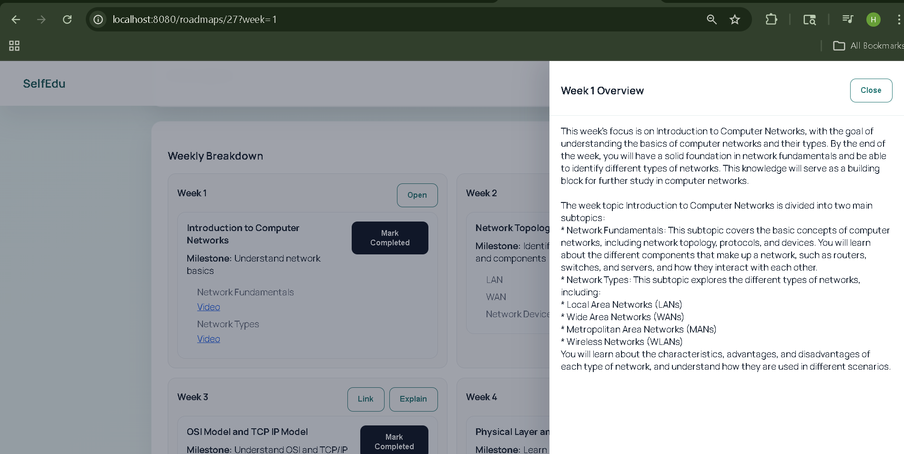
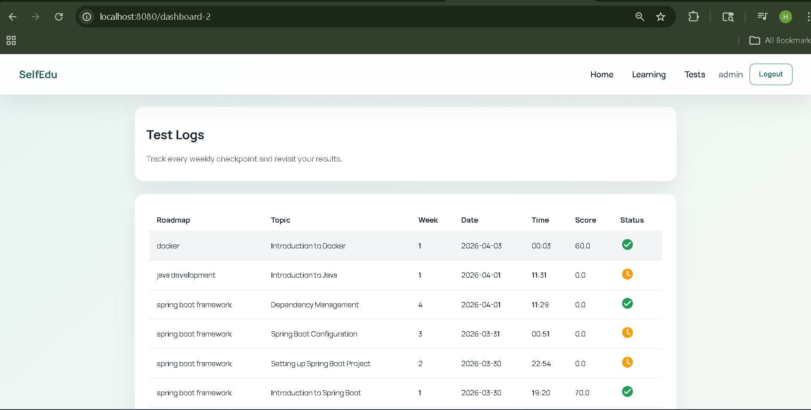

# SelfEdu – AI Powered Self Learning Planner

SelfEdu is a web application that helps learners build a structured self-study journey.
Users can generate a personalized roadmap, follow weekly learning plans, track progress, attempt topic-wise tests, and review analytics in one platform.

The goal is to convert unstructured self-learning into a **clear roadmap with measurable progress**.

---

# Features

* Secure user **registration and login**
* Generate personalized **learning roadmaps**
* Support for **field, level, duration, and custom syllabus topics**
* Weekly roadmap plan with **topics, milestones, and progress tracking**
* **Start Learning** flow from roadmap preview to roadmap detail
* **My Learning** page to access all saved roadmaps
* Topic-level progress update and weekly completion tracking
* AI assisted **weekly explanations**
* Curated **YouTube learning links**
* Topic-wise **MCQ test generation**
* **Test logs** page for attempts, scores, and status
* **Analytics dashboard** for roadmap and test performance
* **Profile and settings** management
* Export roadmap as **PDF**

---

## Home Page


## Dashboard Page


## Generate Roadmap


## My Learning Page


## Weekly Learning Plan


## Test Logs


## Profile Page


---

# How It Works
1. User registers and logs in
2. User lands on the **Home page** and views highlights
3. User opens **Generate Roadmap**
4. User enters:

   * Field
   * Learning level
   * Duration
   * Optional syllabus topics
5. System generates a personalized roadmap
6. User clicks **Start Learning**
7. System opens the **roadmap detail page**
8. User studies week by week and marks topics as completed
9. User can fetch:

   * Learning links
   * Weekly explanations
10. User attempts tests for completed learning sections
11. System stores:

   * Progress
   * Test history
   * Scores
12. User can also navigate using:

   * Dashboard
   * My Learning
   * Tests
   * Analytics
   * Profile

---

# Installation Guide

## Step 1 — Clone the Repository

```bash
git clone https://github.com/yourusername/selfedu.git
```

## Step 2 — Navigate to the Project

```bash
cd Mini_Project1-updating
```

## Step 3 — Configure Database and API Keys

Open:

```
src/main/resources/application.properties
```

Configure your database:

```
spring.datasource.url=jdbc:postgresql://localhost:5432/roadmapdb
spring.datasource.username=your_db_username
spring.datasource.password=your_db_password
```

Configure your API keys:

```
groq.api-key=YOUR_GROQ_API_KEY
youtube.api.key=YOUR_YOUTUBE_API_KEY
```

You can also place the keys in a local `.env` file if preferred.

## Step 4 — Run the Application

Using Maven wrapper on Windows:

```bash
mvnw.cmd spring-boot:run
```

or on macOS/Linux:

```bash
./mvnw spring-boot:run
```

## Step 5 — Open the Application

Open in browser:

```
http://localhost:8080
```
